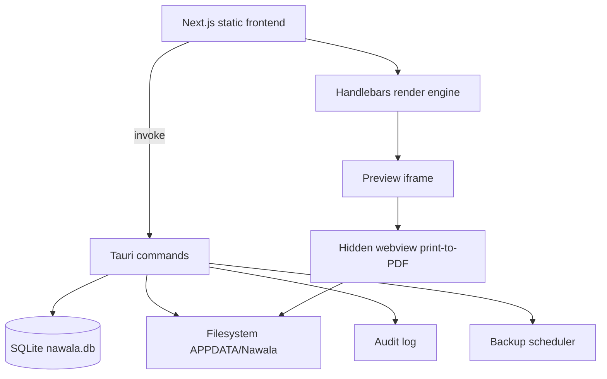
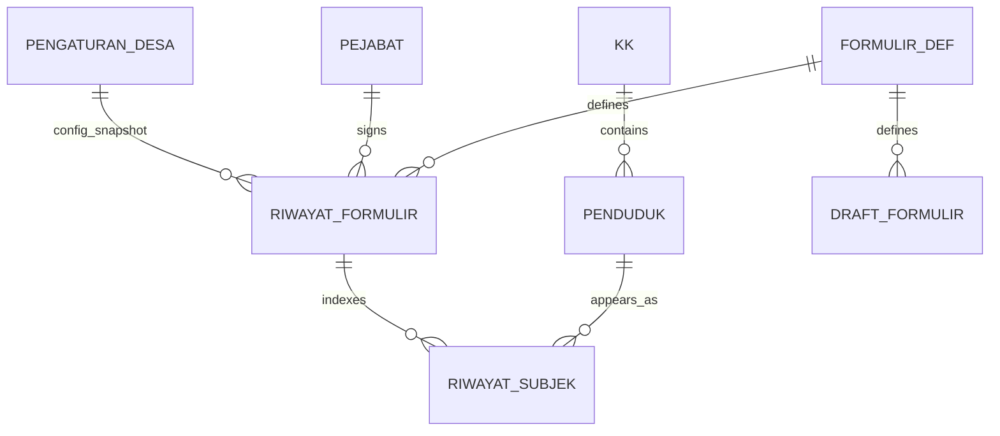

# Nawala - Aplikasi Surat Adminduk Desa

Spec design untuk aplikasi desktop offline yang membantu perangkat desa membuat formulir administrasi kependudukan (formulir F) sesuai Permendagri 73/2022.

## Metadata

| Item | Nilai |
| --- | --- |
| Nama produk | Nawala |
| Tagline | Aplikasi Surat Adminduk Desa |
| Pengembang | EAS Creative Studio |
| Website | https://eas.biz.id |
| Email | dev@eas.biz.id, eas.creative.studio@gmail.com |
| Lisensi | MIT |
| Bundle identifier | id.biz.eas.nawala |
| Target OS | Windows, Linux |
| Database | SQLite |
| UI framework | Next.js, DaisyUI |
| Desktop shell | Tauri |
| Sumber regulasi utama | Permendagri 73/2022 |
| Referensi tambahan | OpenSID umum branch, template formulir F |

## Glossarium

**Nawala** berarti surat atau pesan resmi dari pejabat dalam konteks Jawa Kawi. Nama ini dipilih karena aplikasi berfokus pada pembuatan surat dan formulir resmi administrasi kependudukan di tingkat desa.

**Formulir F** adalah kelompok formulir administrasi kependudukan Dukcapil seperti F-1.02, F-1.16, F-2.01, dan lainnya.

**Buku Induk** adalah spreadsheet data warga desa yang menjadi sumber utama import awal. File contoh yang dianalisis: `/home/eas/Data/BACKUP DATA/Documents/REKAP BUKU INDUK 2025 FIX.xlsx`.

**Snapshot immutable** berarti data formulir yang sudah dicetak disimpan apa adanya dan tidak berubah walaupun data warga diedit di kemudian hari.

## 1. Ringkasan Dan Tujuan

Nawala adalah aplikasi desktop offline untuk membantu operator desa membuat formulir administrasi kependudukan, terutama formulir F yang digunakan untuk layanan pindah, perubahan data keluarga, kelahiran, kematian, perkawinan, dan layanan adminduk lain.

Tujuan utama:

- Menyediakan seluruh formulir F sesuai Permendagri 73/2022.
- Mengurangi input berulang dengan auto-fill dari database warga lokal.
- Mendukung input manual untuk data yang belum lengkap.
- Menghasilkan PDF replika formulir resmi yang siap dicetak.
- Menyimpan riwayat formulir sebagai arsip audit-aman.
- Berjalan offline di komputer balai desa tanpa server.

Non-goals:

- Nawala bukan pengganti SIAK atau sistem resmi Disdukcapil.
- Nawala tidak melakukan validasi NIK ke database Dukcapil.
- Nawala tidak melakukan sinkronisasi cloud dalam rilis awal.
- Nawala tidak menambahkan branding developer pada output formulir resmi.

## 2. Arsitektur Tinggi

Stack final:

- Tauri 2.x sebagai desktop shell dan backend Rust.
- Next.js 15 static export sebagai frontend.
- React 19 dan TypeScript.
- Tailwind CSS 4 dan DaisyUI 5.
- SQLite via rusqlite.
- Refinery untuk migrasi database.
- Handlebars untuk template formulir.
- TanStack Query untuk data fetching.
- Zustand untuk UI state ringan.
- React Hook Form dan Zod untuk validasi form.
- SheetJS untuk import/export XLSX.

Pembagian tanggung jawab:

- Frontend merender UI, wizard formulir, preview, validasi field, dan template Handlebars.
- Backend Rust menangani SQLite, auth, backup, file system, import worker, nomor surat, audit log, dan PDF print window.
- Frontend tidak mengakses database langsung. Semua operasi melewati Tauri command.

Lokasi data runtime:

- Windows: `%APPDATA%/Nawala/`
- Linux: `~/.local/share/Nawala/`
- Database: `nawala.db`
- Backup: `backups/`
- Asset desa: `assets/`
- Export PDF: `exports/`
- Override template: `templates/override/`

Diagram arsitektur:



## 3. Database Design

Database menggunakan SQLite dengan `journal_mode=WAL`, `foreign_keys=ON`, dan `synchronous=NORMAL`.

Core tables:

- `pengaturan_desa`: identitas desa, logo, alamat kantor, default kertas, tema.
- `auth`: password/PIN hash argon2id dan lockout state.
- `pejabat`: data perangkat desa dengan kolom `nipd`.
- `kk`: data Kartu Keluarga.
- `penduduk`: data warga.
- `formulir_def`: definisi template dan schema formulir.
- `nomor_surat_counter`: counter nomor surat per formulir per tahun.
- `draft_formulir`: draft formulir yang belum dicetak.
- `riwayat_formulir`: snapshot immutable formulir tercetak.
- `riwayat_subjek`: index NIK subjek dalam riwayat.
- `audit_log`: audit aktivitas.
- `backup_log`: catatan backup.
- `import_log`: catatan operasi import.

ERD ringkas:



### 3.1 `pejabat`

Perangkat desa memakai NIPD, bukan NIP.

```sql
CREATE TABLE pejabat (
  id INTEGER PRIMARY KEY,
  nama TEXT NOT NULL,
  jabatan TEXT NOT NULL,
  nipd TEXT,
  ttd_path TEXT,
  is_default INTEGER NOT NULL DEFAULT 0,
  aktif INTEGER NOT NULL DEFAULT 1,
  created_at TEXT NOT NULL,
  updated_at TEXT NOT NULL
);
```

### 3.2 `penduduk`

Kolom proper ditambahkan untuk field formulir F yang sering muncul. Semua nullable agar import Buku Induk tetap bisa masuk walaupun data belum lengkap.

Kolom utama:

- `nik`, `no_kk`, `nama_lengkap`, `jenis_kelamin`
- `tempat_lahir`, `tanggal_lahir`
- `agama`, `status_perkawinan`, `pendidikan`, `pekerjaan`
- `hubungan_keluarga`, `kewarganegaraan`
- `nama_ayah`, `nik_ayah`, `nama_ibu`, `nik_ibu`
- `alamat_lengkap`, `rt`, `rw`, `dusun`
- `keterangan`

Kolom adminduk tambahan:

- `golongan_darah`
- `no_paspor`, `tanggal_akhir_paspor`
- `no_kitas`
- `akta_lahir`
- `akta_perkawinan`, `tanggal_perkawinan`
- `akta_perceraian`, `tanggal_perceraian`
- `no_kk_sebelumnya`
- `waktu_lahir`
- `tempat_dilahirkan`
- `jenis_kelahiran`
- `kelahiran_anak_ke`
- `penolong_kelahiran`
- `berat_lahir`
- `panjang_lahir`
- `cacat`
- `sakit_menahun`
- `no_asuransi`
- `email`, `telepon`
- `data_extra` JSON untuk field super-langka.

### 3.3 Snapshot Riwayat

`riwayat_formulir` menyimpan:

- `data_snapshot`: semua data field saat cetak.
- `pejabat_snapshot`: nama, jabatan, NIPD saat cetak.
- `template_snapshot`: HTML template yang dipakai.
- `pdf_path`: lokasi PDF.
- `hash_dokumen`: SHA-256 PDF.

Riwayat lama tidak berubah jika template atau data warga diedit.

## 4. Import Data Warga

Nawala mendukung dua mode import.

### 4.1 Mode Buku Induk

Kompatibel dengan file Buku Induk yang dianalisis. Struktur yang terdeteksi:

| Kolom | Mapping |
| --- | --- |
| NO. URUT | Skip |
| NOMOR KK | `kk.no_kk`, `penduduk.no_kk` |
| NIK | `penduduk.nik` |
| NAMA | `penduduk.nama_lengkap` |
| JENIS KELAMIN | `penduduk.jenis_kelamin` |
| TEMPAT LAHIR | `penduduk.tempat_lahir` |
| TANGGAL LAHIR | `penduduk.tanggal_lahir` |
| UMUR | Skip, dihitung runtime |
| AGAMA | `penduduk.agama` |
| STATUS | `penduduk.status_perkawinan` |
| HUBUNGAN KELUARGA | `penduduk.hubungan_keluarga` |
| KEPALA KELUARGA L/P | Skip, redundant |
| PENDIDIKAN | `penduduk.pendidikan` |
| PEKERJAAN | `penduduk.pekerjaan` |
| NAMA IBU | `penduduk.nama_ibu` |
| NAMA AYAH | `penduduk.nama_ayah` |
| ALAMAT | `penduduk.alamat_lengkap`, `kk.alamat` |
| RT | `penduduk.rt`, `kk.rt` |
| RW | `penduduk.rw`, `kk.rw` |
| KET | `penduduk.keterangan` |

Parser menerima tanggal lahir dalam bentuk Excel serial date, `dd-mm-yyyy`, `dd/mm/yyyy`, atau `yyyy-mm-dd`.

Default konflik import: **Skip** jika NIK sudah ada. User dapat mengganti ke Update per operasi import.

### 4.2 Mode Lengkap

Aplikasi menyediakan template XLSX dengan sheet `KK` dan `Penduduk`. Mode ini mencakup seluruh kolom proper adminduk yang didukung.

### 4.3 Flow Import

1. User pilih file XLSX/CSV.
2. User pilih mode: Buku Induk atau Lengkap.
3. Parser membaca file dan validasi per baris.
4. UI menampilkan halaman review: valid rows, error rows, konflik NIK.
5. User dapat import valid saja atau batal.
6. Error rows dapat di-download sebagai CSV.
7. Insert/update dijalankan dalam transaksi batch.
8. Hasil dicatat ke `import_log` dan `audit_log`.

## 5. Resolusi Otomatis Data Ayah/Ibu

Buku Induk hanya menyimpan nama ayah/ibu, tidak selalu NIK ayah/ibu. Nawala melakukan resolusi NIK otomatis secara lazy saat formulir membutuhkan data ortu.

Algoritma:

```text
INPUT: pemohon P dengan no_kk K, nama_ayah A, nama_ibu I

1. Ambil semua anggota KK dengan no_kk = K.
2. Kandidat ayah:
   - hubungan_keluarga IN (Kepala Keluarga, Suami, Ayah)
   - jenis_kelamin = L
   - hitung Jaro-Winkler(nama_kandidat, A)
3. Kandidat ibu:
   - hubungan_keluarga IN (Istri, Kepala Keluarga, Ibu)
   - jenis_kelamin = P
   - hitung Jaro-Winkler(nama_kandidat, I)
4. Jika score >= 0.90 dan unik, auto-fill dan write-back.
5. Jika 0.70 <= score < 0.90, tampilkan kandidat untuk konfirmasi.
6. Jika score < 0.70 atau tidak ada kandidat, user input manual.
7. Setelah user konfirmasi/manual, write-back ke pemohon dan saudara satu KK dengan nama ortu sama.
```

Preprocessing nama:

- Uppercase.
- Trim dan collapse spasi.
- Hilangkan gelar umum seperti `H.`, `HJ.`, `DRS.`, `IR.`, `S.PD`.

Audit action: `RESOLVE_PARENT_NIK` dengan metadata confidence, sumber (`auto`, `confirm`, `manual`), dan jumlah saudara yang ikut di-update.

## 6. Engine Formulir

Tiap formulir didefinisikan sebagai data, bukan komponen hardcoded.

File per formulir:

- `resources/templates/F-1.02.html`
- `resources/schemas/F-1.02.json`

Definisi JSON:

```json
{
  "kode": "F-1.02",
  "nama": "Formulir Pendaftaran Peristiwa Kependudukan",
  "kategori": "Pendaftaran Penduduk",
  "ukuran_kertas": "F4",
  "orientasi": "portrait",
  "versi_regulasi": "Permendagri 73/2022",
  "versi_template": 1,
  "subjek": [
    { "kode": "individu", "label": "Pemohon", "wajib": true, "sumber": "penduduk" }
  ],
  "field": [
    {
      "kode": "jenis_permohonan",
      "label": "Jenis Permohonan",
      "tipe": "select",
      "wajib": true,
      "opsi_ref": "jenis_permohonan"
    }
  ],
  "nomor_surat": {
    "pakai": true,
    "pola": "{seq:4}/{kode}/{kode_desa}/{romawi:bulan}/{tahun}"
  },
  "tanda_tangan": {
    "pejabat_default": "Kepala Desa"
  }
}
```

Tipe field yang didukung:

- `text`, `textarea`, `number`, `date`, `select`, `multiselect`, `radio`, `checkbox`
- `nik`, `subjek_ref`, `repeater`, `nomor_surat_preview`

Conditional field:

- `tampil_jika` dengan operator `eq`, `ne`, `in`, `nin`, `gt`, `lt`.

Handlebars helpers:

- `upper`, `lower`, `title_case`
- `tgl_indo`
- `format_tanggal`
- `umur`
- `terbilang`
- `default`
- `eq`, `ne`, `in`

Template naming convention menggunakan nama dekat OpenSID untuk readability, misalnya `{{individu.nama}}`, `{{individu.nik}}`, `{{config.nama_desa}}`, tetapi template ditulis ulang dari nol agar lisensi Nawala tetap MIT.

## 7. Modul Aplikasi

### 7.1 Onboarding

First-run wizard:

1. Set PIN/password.
2. Isi identitas desa.
3. Tambah minimal satu pejabat default.
4. Pilih tema dan ukuran kertas default.

### 7.2 Login

- Password/PIN dengan argon2id.
- Lockout 5 gagal: 5 menit, lanjut 30 menit, lanjut 24 jam.
- Idle timeout default 30 menit.

### 7.3 Dashboard

- Total warga.
- Total KK.
- Total formulir bulan ini.
- Riwayat terbaru.
- Quick actions: buat formulir, import warga, backup sekarang.

### 7.4 Data Warga

- Daftar warga dengan search NIK/nama.
- Daftar KK.
- Detail warga.
- Edit minor.
- Tambah manual.
- Import Buku Induk/Lengkap.
- Export semua warga ke XLSX.

### 7.5 Formulir

Wizard 3 step:

1. Pilih subjek warga atau input manual.
2. Isi field tambahan, pejabat, tanggal, nomor surat.
3. Preview dan cetak.

Jika field warga kosong tapi diperlukan formulir, wizard meminta input manual dan menawarkan write-back ke DB.

### 7.6 Riwayat

- Filter by kode formulir, tanggal, NIK, nomor surat.
- Lihat snapshot.
- Cetak ulang identik.
- Cetak ulang dengan data terbaru hanya dengan warning eksplisit.
- Hapus riwayat hanya dari Maintenance dengan re-auth dan alasan.

### 7.7 Pengaturan

- Identitas desa.
- Pejabat.
- Pola nomor surat.
- Tampilan.
- Keamanan.
- Backup.
- Audit log.
- Tentang.

### 7.8 Maintenance

- Reset counter.
- Hapus draft lama.
- Hapus riwayat dengan alasan.
- Re-seed template.
- Vacuum DB.

## 8. Nomor Surat

Pola default:

```text
{seq:4}/{kode}/{kode_desa}/{romawi:bulan}/{tahun}
```

Token:

- `{seq:N}`
- `{kode}`
- `{kode_desa}`
- `{tahun}`
- `{tahun_pendek}`
- `{bulan}`
- `{romawi:bulan}`
- `{tanggal}`
- `{custom:NAMA}`

Counter disimpan per `(kode_formulir, tahun)`. Override manual tidak meng-increment counter.

## 9. Backup Dan Restore

Manual backup:

- Checkpoint WAL.
- Copy `nawala.db` ke `backups/manual/<timestamp>.db`.
- Hitung SHA-256.
- Catat ke `backup_log`.

Auto backup:

- Off/harian/mingguan.
- Jika aplikasi tidak running saat jadwal, backup dilakukan pada startup berikutnya jika interval terlewat.
- Retention default: 14 backup harian atau 8 backup mingguan.

Restore:

- Verify backup dengan `PRAGMA integrity_check`.
- Buat pre-restore backup kondisi sekarang.
- Replace DB.
- Reopen connection.

Export arsip:

- XLSX sheet `KK`, `Penduduk`, `Pejabat`, `RiwayatFormulir`.

## 10. Auth, Audit, Error Handling

Security model:

- Offline single-user.
- Melindungi dari penggunaan aplikasi oleh orang lain di komputer yang sama.
- DB tidak dienkripsi at rest untuk MVP.

Audit log mencatat:

- Login sukses/gagal.
- Import warga.
- Tambah/edit/hapus warga.
- Buat/cetak formulir.
- Cetak ulang riwayat.
- Backup/restore.
- Reset counter.
- Edit pengaturan.
- Resolusi otomatis ortu.

Error model:

```ts
type AppError = {
  kind: 'Database' | 'Validation' | 'NotFound' | 'Conflict' | 'Auth' | 'FileSystem' | 'Import' | 'Internal'
  message: string
  details?: unknown
}
```

Semua pesan user-facing menggunakan Bahasa Indonesia.

## 11. Formulir F Dan Sumber Referensi

Ground truth utama adalah Permendagri 73/2022. OpenSID dipakai sebagai referensi tambahan untuk memahami struktur template, daftar field, dan kode dropdown. Template tidak di-copy verbatim agar lisensi Nawala tetap MIT.

Template OpenSID yang ditemukan di `storage/app/template/lampiran/`:

| Kode | Referensi OpenSID |
| --- | --- |
| F-1.01 | `f-1.01/`, `f-1.01-malang/` |
| F-1.02 | `f-1.02/`, `f-1.02-malang/` |
| F-1.03 | `f-1.03/`, `f-1.03-malang/` |
| F-1.06 | `f-1.06/` |
| F-1.08 | `f-1.08/` |
| F-1.15 | `f-1.15/` |
| F-1.16 | `f-1.16/` |
| F-1.25 | `f-1.25/` |
| F-1.27 | `f-1.27/` |
| F-2.01 | `f-2.01/`, `f-2.01-kelahiran/`, `f-2.01-kematian/` |
| F-2.12 | `f-2.12/` |
| F-2.29 | `f-2.29/` |
| F-2.30 | `f-2.30/` |

Rilis pertama tetap menargetkan seluruh formulir F. Formulir yang belum tersedia referensinya di OpenSID masuk Tier 2 dan harus divalidasi dari PDF Permendagri atau sumber resmi lain sebelum rilis.

Dev-only compare mode disediakan untuk membandingkan PDF Nawala vs referensi OpenSID/PDF resmi selama development.

## 12. Master Kode Dropdown

Nilai berikut diadopsi sebagai data referensi karena berasal dari domain Permendagri dan ditemukan juga pada OpenSID `kode.php`.

### Alasan Pindah

| Kode | Nilai |
| --- | --- |
| 1 | Pekerjaan |
| 2 | Pendidikan |
| 3 | Keamanan |
| 4 | Kesehatan |
| 5 | Perumahan |
| 6 | Keluarga |
| 7 | Lainnya |

### Klasifikasi Pindah

| Kode | Nilai |
| --- | --- |
| 1 | Dalam satu Desa/Kelurahan |
| 2 | Antar Desa/Kelurahan |
| 3 | Antar Kecamatan |
| 4 | Antar Kab/Kota |
| 5 | Antar Provinsi |

### Jenis Kepindahan

| Kode | Nilai |
| --- | --- |
| 1 | Kep. Keluarga |
| 2 | Kep. Keluarga dan Seluruh Angg. Keluarga |
| 3 | Kep. Keluarga dan Sbg. Angg. Keluarga |
| 4 | Angg. Keluarga |

### Status KK Bagi Yang Pindah

| Kode | Nilai |
| --- | --- |
| 1 | Numpang KK |
| 2 | Membuat KK Baru |
| 3 | Nomor KK Tetap |

### Status KK Bagi Yang Tidak Pindah

| Kode | Nilai |
| --- | --- |
| 1 | Numpang KK |
| 2 | Membuat KK Baru |
| 3 | Tidak Ada Angg. Keluarga Yang Ditinggal |
| 4 | Nomor KK Tetap |

### Jenis Permohonan

| Kode | Nilai |
| --- | --- |
| 1 | Surat Keterangan Kependudukan |
| 2 | Surat Keterangan Pindah |
| 3 | Surat Keterangan Pindah Luar Negeri (SKPLN) |
| 4 | Surat Keterangan Tempat Tinggal (SKTT) |
| 5 | Bagi Orang Asing Tinggal Terbatas |

### Tipe Sponsor

| Kode | Nilai |
| --- | --- |
| 1 | Organisasi Internasional |
| 2 | Perorangan |
| 3 | Pemerintah |
| 4 | Tanpa Sponsor |
| 5 | Perusahaan |

## 13. Project Structure

```text
repository-root/
├── src-tauri/
│   ├── Cargo.toml
│   ├── tauri.conf.json
│   └── src/
│       ├── main.rs
│       ├── app.rs
│       ├── error.rs
│       ├── auth/
│       ├── db/
│       ├── repo/
│       ├── service/
│       ├── commands/
│       └── resources/
│           ├── templates/
│           ├── schemas/
│           └── reference/
├── src/
│   ├── app/
│   │   ├── login/
│   │   ├── onboarding/
│   │   ├── warga/
│   │   ├── kk/
│   │   ├── formulir/
│   │   ├── riwayat/
│   │   ├── pengaturan/
│   │   ├── maintenance/
│   │   └── print/[draftId]/
│   ├── components/
│   ├── hooks/
│   ├── lib/
│   ├── stores/
│   ├── styles/
│   └── types/
├── docs/
│   └── superpowers/
│       ├── specs/
│       └── plans/
├── tests/
│   ├── e2e/
│   ├── rust/
│   └── fixtures/
├── package.json
├── pnpm-lock.yaml
├── next.config.js
├── tsconfig.json
├── biome.json
├── LICENSE
└── README.md
```

## 14. Testing Strategy

Rust tests:

- Repository CRUD.
- Import parser Buku Induk.
- Excel serial date conversion.
- Resolusi ortu Jaro-Winkler.
- Nomor surat generator.
- Backup/restore integrity.

Frontend tests:

- Handlebars helpers.
- Zod validators.
- Wizard state transitions.
- Import review UI.

E2E tests:

- First-run onboarding.
- Login.
- Import Buku Induk fixture.
- Buat formulir F-1.02 dari warga.
- Resolusi ortu pada formulir kelahiran.
- Cetak PDF dan simpan riwayat.
- Backup dan restore.

Visual QA:

- PDF output dibandingkan side-by-side dengan PDF resmi atau referensi OpenSID.
- Checklist QA per formulir: ukuran kertas, margin, field, alignment, tanda tangan, nomor surat.

## 15. Distribution

Windows:

- MSI/EXE installer via Tauri bundler.
- Publisher: EAS Creative Studio.

Linux:

- AppImage dan `.deb`.

Auto-update:

- Opsional, menggunakan Tauri updater dan GitHub Releases.
- Dapat dimatikan untuk instalasi offline.

Branding:

- Splash screen 3 detik.
- Login footer.
- Menu Tentang.
- Tidak muncul di output PDF formulir.

## 16. Risks And Mitigations

| Risiko | Mitigasi |
| --- | --- |
| Field formulir tidak sesuai Permendagri | QA side-by-side dengan PDF resmi per formulir |
| OpenSID berbeda dari regulasi terbaru | OpenSID hanya referensi, Permendagri 73/2022 tetap ground truth |
| Data warga tidak lengkap | Field nullable, input manual saat buat formulir, write-back ke DB |
| Salah auto-resolve ayah/ibu | Threshold konservatif 0.90, konfirmasi 0.70-0.89, audit log |
| PDF tidak presisi | Template F4/A4 khusus, visual QA, dev compare mode |
| DB rusak | WAL, backup manual/auto, integrity check saat restore |
| Nomor surat loncat | Counter increment hanya saat commit riwayat, override manual tidak increment |
| Lisensi OpenSID | Tidak copy template verbatim; tulis ulang sendiri |

## 17. Open Questions

Tidak ada open question blocking untuk fase implementation planning. Riset lanjutan tetap diperlukan untuk daftar lengkap formulir Tier 2 dan PDF resmi masing-masing formulir.

## 18. Acceptance Criteria

Spec dianggap valid bila:

- Semua keputusan desain dari brainstorming tercakup.
- Tidak ada placeholder blocking.
- Scope MVP jelas: rilis pertama menargetkan seluruh formulir F setelah riset Tier 2 selesai.
- Data warga Buku Induk dapat di-import tanpa harus melengkapi semua field.
- Riwayat formulir bersifat immutable.
- Identitas produk final adalah Nawala by EAS Creative Studio.
